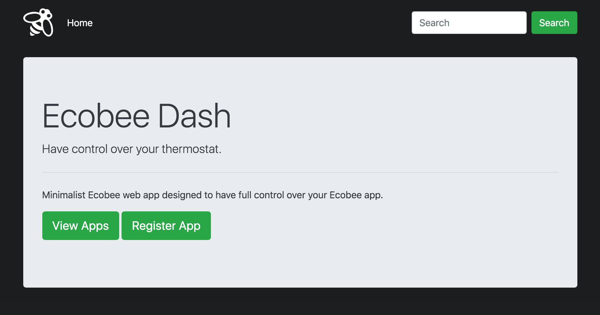
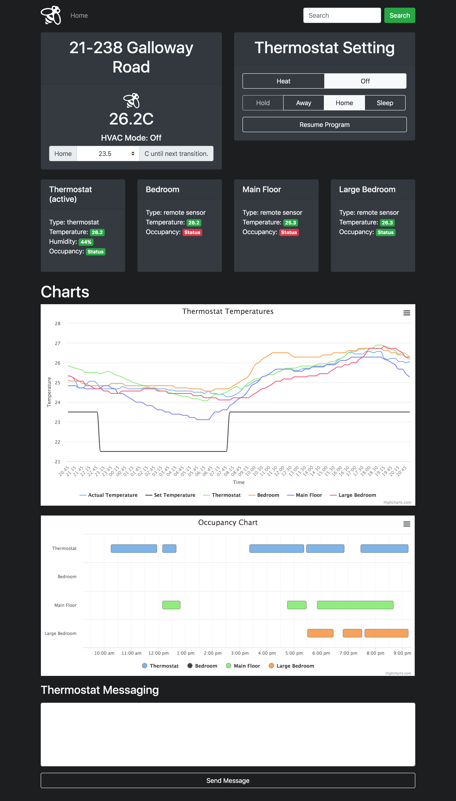

# Ecobee Dashboard
Dashboard to interact with Ecobee API. You can register your thermostats on the dashboard to control thermostat settings and access/monitor thermostat information including HVAC mode, temperature, sensor temperatures, sensor occupancy, humidity, and climate setting.

## Screenshots



## Getting Started
These instructions will get you a copy of the project up and running on your local machine for development and testing purposes.

### Requirements
* Python3.6+
* pip3
* SQL (configure your SQL settings in ecobee-dashboard/back-end/ecobee/config.py file)

### Installation
A step by step series of examples that tell you how to get a development environment running.

```
cd ~
git clone https://github.com/itzliu/ecobee.git
mkdir ~/logs
cd ecobee/back-end
python3 -m venv venv
source venv/bin/activate
pip install -r requirements.txt
python run.py
```

Prior to running the application you need to setup your SQL configuration for storing API credentials inside the ecobee-dashboard/back-end/ecobee/config.py file.


## Built With
* Ecobee API
* Flask - back-end framework
* SQL - database
* Angular - front-end framework
* Bootstrap - templating

## What I Learned
* How to interact with Ecobee IOT device through JSON REST API.
* How to build RESTful APIs.
* Logging and reading CSV files.
* How to make charts using Highchart.js.
* Design a dashboard using HTML, CSS, and JQuery.

## Authors
* Harry Liu

## Acknowledgements
* Built based on [this Python Ecobee API](https://github.com/nkgilley/python-ecobee-api) from GitHub by [nkgilley](https://github.com/nkgilley).
