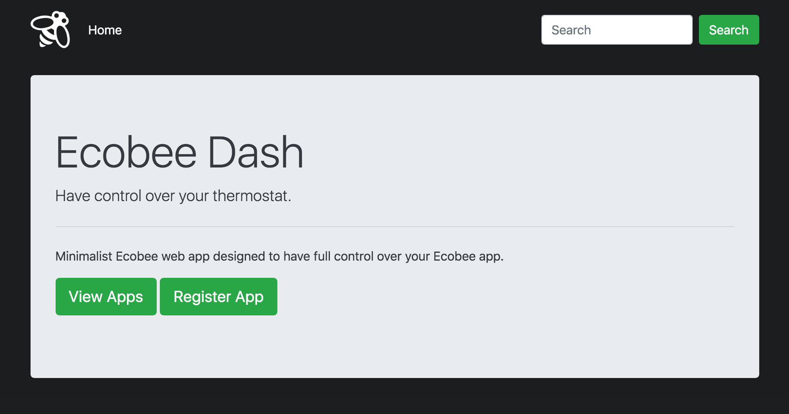
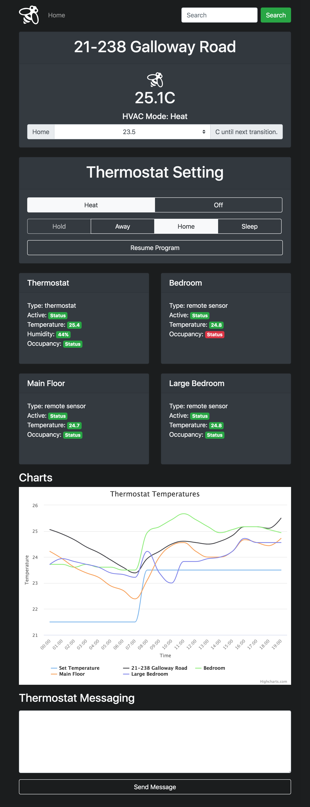

# Ecobee Dashboard
Dashboard to interact with Ecobee API. You can register your thermostats on the dashboard to control thermostat settings and access/monitor thermostat information such as room temperatures or room occupancy.

## Screenshots



## Getting Started
These instructions will get you a copy of the project up and running on your local machine for development and testing purposes.

### Requirements
* Python3.6+
* pip3
* SQL

### Installation
A step by step series of examples that tell you how to get a development environment running.

Clone the repository onto your machine.
```
git clone https://github.com/itzliu/ecobee.git
```
Create folder for logs in home directory.
```
mkdir ~/logs
```
Change directory into the project directory folder.
```
cd ecobee-dashboard
```
Create a virtual environment for the app.
```
python3 -m venv venv
```
Activate your virtual environment.
```
source venv/bin/activate
```
Install Python dependencies.
```
pip install -r requirements.txt
```
Run the application.
```
python run.py
```

## Built With
* Flask - framework
* SQL - database
* Bootstrap - templating

## What I Learned
* How to interact with Ecobee IOT device through JSON REST API.
* How to build RESTful APIs.
* Logging and reading CSV files.
* How to make charts using Highchart.js.
* Design a dashboard using HTML, CSS, and JQuery.

## Authors
* Harry Liu

## Acknowledgements
* Built based on [this Python Ecobee API](https://github.com/nkgilley/python-ecobee-api) from GitHub by [nkgilley](https://github.com/nkgilley).
