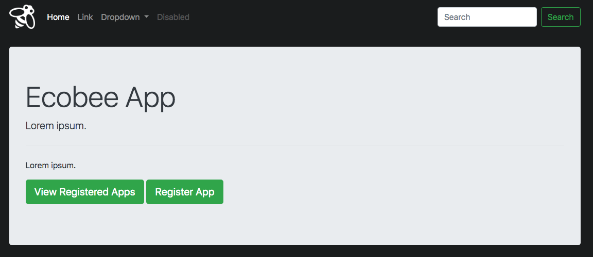
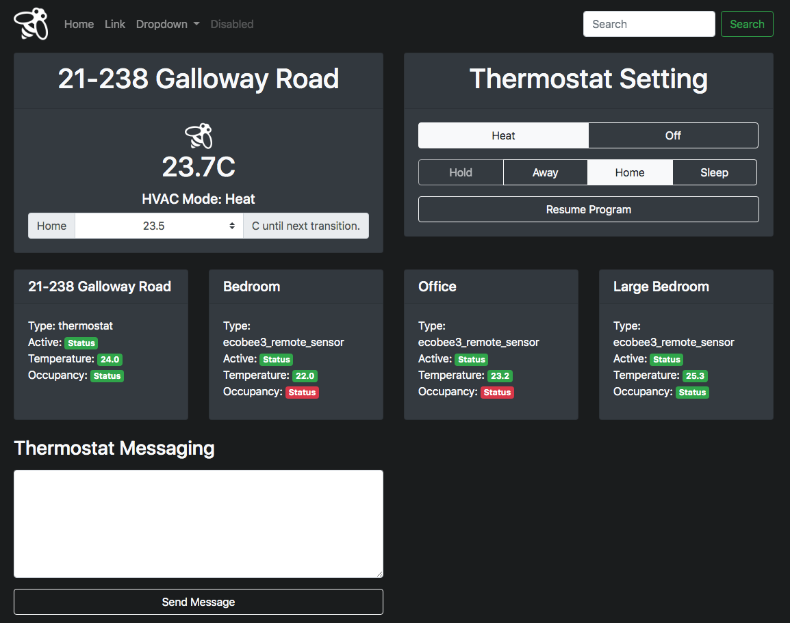

# ecobee
Dashboard to interact with ecobee API.

## What I Learned
* How to interact with IOT devices through web API
* Impletment MySQL database to Flask project.

## Getting Started
These instructions will get you a copy of the project up and running on your local machine for development and testing purposes. 

### Prerequisites
* Python3.6+
* pip3
* SQL

### Installing
A step by step series of examples that tell you how to get a development environment running.

Clone the repository onto your machine.
```
git clone https://github.com/itzliu/ecobee.git
```
Change directory into the project directory folder.
```
cd ecobee
```
Create a virtual environment for the app.
```
python3 -m venv venv
```
Activate your virtual environment.
```
source venv/bin/activate
```
Install the Pyhon dependencies for MySQL or Postgres.
```
pip install -r requirements-mysql.txt
pip install -r requirements-postgres.txt
```
To get mysqlclient to work properly go to [this link](https://pypi.org/project/mysqlclient/) for help.

Run the application.
```
python run.py
```
## Running Tests
N/a

## Built With
* Flask - framework
* SQL - database

## Screenshots



## Authors
* Harry Liu

## Acknowledgements
* Built based on [this Python Ecobee API](https://github.com/nkgilley/python-ecobee-api) from GitHub by [nkgilley](https://github.com/nkgilley).
