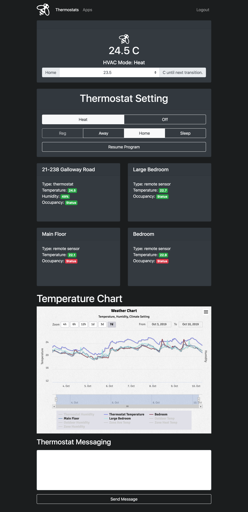

# Ecobee Dashboard
Dashboard to view and interact with your Ecobee thermostats.

## Screenshots


### 

### Installing
Steps to get a development environment running:

Clone project and set up logging folder.
```
cd ~
git clone https://github.com/iamharryliu/ecobee-dashboard.git
mkdir ~/logs
```

Setup and run Django back-end server.
```
cd ~/ecobee-dashboard/back-end-django
python3 -m venv venv
source venv/bin/activate
pip install -r requirements.txt
python manage.py migrate --run-syncdb
python manage.py runserver
```

Setup and run Flask back-end server.
```
cd ~/ecobee-dashboard/back-end-flask
python3 -m venv venv
source venv/bin/activate
pip install -r requirements.txt
python manage.py db init
python manage.py db migrate
python manage.py db upgrade
python manage.py runserver
```

Setup and run Angular front-end server.
```
cd ~/ecobee-dashboard/front-end-angular
npm install
npm start
```

Setup and run React front-end server.
```
cd ~/ecobee-dashboard/front-end-react
npm install
npm start
```